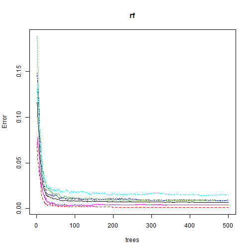

Practical Machine Learning - Data Science Specialisation 
========================================================


This project aims to explore a dataset that contains information about how well people perform certain types of physical activities on weight lifting. In addition, a predictve model will be built utilising a machine learning algorithm and will be evaluate using a validation and testing data set. 

The study will utilise data from accelerometers on the belt, forearm, arm, and dumbell of 6 participants. They were asked to perform barbell lifts correctly and incorrectly in 5 different ways. More information is available from the website on [Human Activity Recognition](http://groupware.les.inf.puc-rio.br/har) (see the section on the Weight Lifting Exercise Dataset. 

This study aims to develop a model to predict the manner in which people did the exercise:

* First the data was explored, cleaned and prepared. 
* Random Forest has been chosen to build the prediction model
* The training set was divided into training/ validation set (60% and 40% respectively)
* The randomforest model was built using the training data
* Validated on the validation test
* And finally the model was used to predict the class labe for the 20 test cases (reported at the end of this report)

## Getting, Exploring and Cleaning Data 

#### (1) Obtaining Data
The data sets for this study was obtained from [Coursera Data Science Specialisation- Practical Machine Learning](https://class.coursera.org/predmachlearn-002). It can also be obtained from [Human Activity Recognition](http://groupware.les.inf.puc-rio.br/har). 

#### (2) Setting Working Environment and Loading Data

The code below sets the working directory, loads the training and testing data sets. Testing dataset will only be used at later stage for testing the fitted model. 

```r
setwd("C:/Research/Self-Development/Data-Science/8_Practical_Machine_Learning/cwFinal")
```


```r
## Read data, handle whitespace ...
training <- read.csv("data/pml-training.csv", header = TRUE, na.strings = c("NA", 
    "NaN", "", " "), stringsAsFactors = FALSE)
```


```r
## Read testing, handle whitespace ...
testing <- read.csv("data/pml-testing.csv", header = TRUE, na.strings = c("NA", 
    "NaN", "", " "), stringsAsFactors = FALSE)
```

#### (3) Exploring Data

A quick glance at the training data, shows that several features (columns) have a lot of missing values. A simple function has been developed to count how many missing values per/feature

```r
countMissings <- function(df) {
    
    # get missing values per column
    colIndex <- c(1:ncol(df))
    dfMissings <- data.frame(colIndex)
    dfMissings$NoOfMissings <- 0
    colnames(dfMissings) <- c("colIndex", "NoMissings")
    
    for (i in 1:ncol(df)) {
        
        dfMissings[i, 2] = sum(is.na(df[, i]))
        
    }
    ## return data frame with colIndex and number of missing Values
    dfMissings
}
## get missing value in each column of the training set
MissingVals <- countMissings(training)
tableMissing <- data.frame(table(MissingVals$NoMissings))
colnames(tableMissing) <- c("Total_Missing_Values_in_Column", "Number_of_Columns")
tableMissing
```

```
##   Total_Missing_Values_in_Column Number_of_Columns
## 1                              0                60
## 2                          19216               100
```

The table above shows that there is a **100** column in the training set with more than **19000** missing values. In othe words, these columns can be easily dropped from the data set. 

#### (4) Cleaning Dataset

The functions below aims to drop all columns in an arbitrary dataframe subject to the percentage of a missing values in each column. To get a better idea how these functions were used. Please See the following function. 


```r
getColsToDrop <- function(df, precent) {
    # get missing values per column
    colIndex <- c(1:ncol(df))
    dfMissings <- data.frame(colIndex)
    dfMissings$NoOfMissings <- 0
    colnames(dfMissings) <- c("colIndex", "NoMissings")
    
    for (i in 1:ncol(df)) {
        
        dfMissings[i, 2] = sum(is.na(df[, i]))
        
    }
    dfMissings <- dfMissings[dfMissings$NoMissings/nrow(df) > precent, ]
    ## column names with 95% missing values
    dorppedNames <- colnames(df[, dfMissings$colIndex])
    
}

## subset and drop the above columns
cleanData <- function(df, percent) {
    df <- df[, !(names(df) %in% getColsToDrop(df, percent))]
}

```

Here, we call **cleanData** to drop all columns from the training set which has more than 95% missing values (relative to the total number of observations in the data set). This leaves only 60 columns in our training dataset as can be see below.

```r
## Remove features with more than 95% missing values
training <- cleanData(training, 0.95)
cat("Number of Columns in the Training Set", ncol(training))
```

```
## Number of Columns in the Training Set 60
```


```r
## Drop the first 7 columns of the updated training set as they appear to be
## not important for prediction purposes
training <- training[, !(names(training) %in% colnames(training[, c(1:7)]))]
training$classe <- factor(training$classe)  ## This important for randomForest 
```


## Building a Prediction Model 

For this project, Random Forest has been chosen as a machine learning technique to develop the prediction Model. Random Forest outperformed many other machine learning techniques, it is an ensemble learning method for classification / regression trees. Several **r** packges have been developed and freely available that implements Random forest. For this study, we are using the [Random Forest Package](http://cran.r-project.org/web/packages/randomForest/index.html). The manual on how to use this package can be found [here](http://cran.r-project.org/web/packages/randomForest/randomForest.pdf).

### (1) Divide the Training Set into Training/ Validation Sets

The first step in building the model is to allocate some data as for validation purposes. 

```r
## require randomForest Library
library(randomForest)
```

```
## randomForest 4.6-7
## Type rfNews() to see new features/changes/bug fixes.
```

```r
library(caret)
```

```
## Loading required package: lattice
## Loading required package: ggplot2
```

```r
library(kernlab)
```


```r

## partition the data
inTrain <- createDataPartition(y = training$classe, p = 0.6, list = FALSE)

trainingSet <- training[inTrain, ]
testingSet <- training[-inTrain, ]
```


#### (2) Training the Model 

The code below shows how the random forest is built in r to train the training data. It is important to point out that the forest use all predictors to predict the outcome. 

```r

## Traing the rforest
set.seed(1431)
rf <- randomForest(classe ~ ., data = trainingSet, importance = TRUE, ntree = 500, 
    proximity = TRUE, keep.forest = TRUE)

```

As can bee seen From the Results and the confusion matrix, the out of sample error is  0.58% with an accuracy of 94.2%. Notice here that the number of variables selected for splitting trees is set to the default value which is the squre root of the total number of variables. It was also found out that increasing the number of trees in the forest won't significantly change the results. 

```r
print(rf)
```

```
## 
## Call:
##  randomForest(formula = classe ~ ., data = trainingSet, importance = TRUE,      ntree = 500, proximity = TRUE, keep.forest = TRUE) 
##                Type of random forest: classification
##                      Number of trees: 500
## No. of variables tried at each split: 7
## 
##         OOB estimate of  error rate: 0.69%
## Confusion matrix:
##      A    B    C    D    E class.error
## A 3343    3    1    0    1    0.001493
## B   14 2260    5    0    0    0.008337
## C    0   17 2035    2    0    0.009250
## D    0    0   27 1901    2    0.015026
## E    0    0    3    6 2156    0.004157
```

```r
plot(rf)
```

 

#### (3) Validating the Model 

Here, we use the remaining 40% of the training set which was held out for testing purposes. 


```r
validatePred <- predict(rf, testingSet)
testingSet$predRight <- validatePred == testingSet$classe
table(validatePred, testingSet$classe)
```

```
##             
## validatePred    A    B    C    D    E
##            A 2231   14    0    0    0
##            B    1 1496    6    0    0
##            C    0    8 1359   12    2
##            D    0    0    3 1274   10
##            E    0    0    0    0 1430
```

```r

OOBTraining <- mean(predict(rf) != trainingSet$classe)
cat("Out of Bag Error on Training Data", OOBTraining)
```

```
## Out of Bag Error on Training Data 0.006878
```

```r
OOBTesting <- mean(predict(rf, newdata = testingSet) != testingSet$classe)
cat("Out of Bag Error on the Validation Data", OOBTesting)
```

```
## Out of Bag Error on the Validation Data 0.007137
```

```r

```


#### (4) Testing the Model (Courework Submissions)

In this part of the study, we will use our model to predict the lable of 20 different test cases provided in **pml-testing.csv** 


```r
## Remove features with more than 95% missing values in the testing set
testing <- cleanData(testing, 0.95)
## Drop the first 7 columns of the updated training set
testing <- testing[, !(names(testing) %in% colnames(testing[, c(1:7)]))]
testPred <- predict(rf, testing)
testing$predicted <- testPred
results <- testing[, c("problem_id", "predicted")]
```

Below is the results for the 20 test cases. In addition, the code to generate 20 files, each of which contains the lable of the corresponding test case (adopted from coursera/ DS)

```r
results
```

```
##    problem_id predicted
## 1           1         B
## 2           2         A
## 3           3         B
## 4           4         A
## 5           5         A
## 6           6         E
## 7           7         D
## 8           8         B
## 9           9         A
## 10         10         A
## 11         11         B
## 12         12         C
## 13         13         B
## 14         14         A
## 15         15         E
## 16         16         E
## 17         17         A
## 18         18         B
## 19         19         B
## 20         20         B
```


```r
## Function to output results (adopted from DS specialisation)
pml_write_files = function(x) {
    n = length(x)
    for (i in 1:n) {
        filename = paste0("problem_id_", i, ".txt")
        write.table(x[i], file = filename, quote = FALSE, row.names = FALSE, 
            col.names = FALSE)
    }
}
setwd("results")  ##store results in 'results' directory
pml_write_files(testing$predicted)
setwd("../")  ## restore working directory
```

